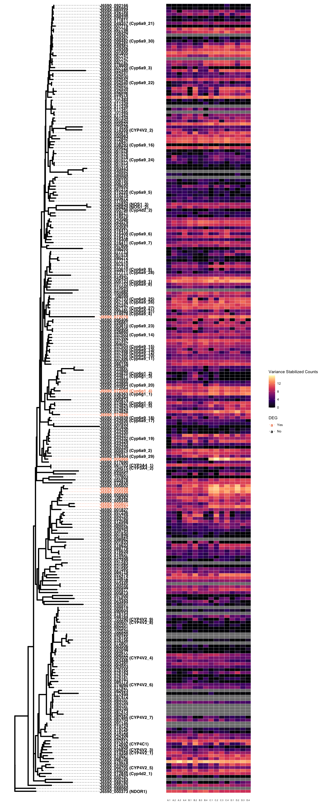
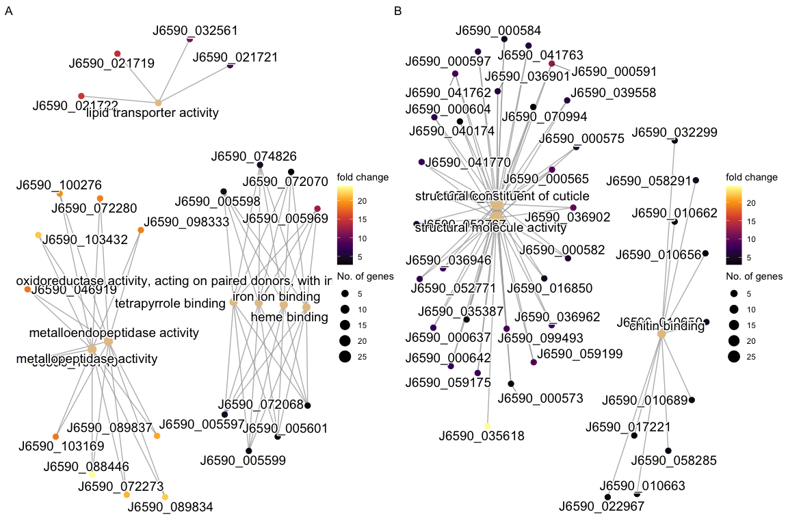
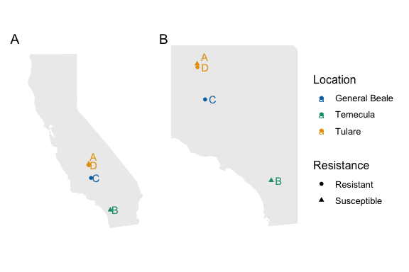

RMarkDown for: Transcriptome and Population Structure of Glassy-winged
Sharpshooters (Homalodisca vitripennis) with Varying Insecticide
Resistance in Southern California
================
Cassie Ettinger
3/24/2022

This RMarkDown describes the various R code and analyses used in the
manuscript “Transcriptome and Population Structure of Glassy-winged
Sharpshooters (Homalodisca vitripennis) with Varying Insecticide
Resistance in Southern California”. Briefly, this RMarkDown is organized
as follows: (1) transcriptome expression analysis, (2) GO term
functional enrichment, (3) population genetic analyses using SNPs from
the transcriptome data, and (3) genetic architecture of top resistance
gene candidate.

## Loading R libraries

``` r
library(biobroom)
library(tidyverse)
library(vroom)
library(DESeq2)
library(ggplot2)
library(Biobase)
library(pheatmap)
library(RColorBrewer)
library(patchwork)
library(clusterProfiler)
library(AnnotationForge)
library(enrichplot)
library(pathview)
library(ggupset)
library(ggtree)
library(treeio)
library(ape)
library(adegenet)
library(hierfstat)
library(pegas)
library(gdsfmt)
library(SNPRelate)
library(poppr)
library(vcfR)
library(ggplotify)
library(LEA)
library(OutFLANK)
library(gggenomes)
library(viridis)
library(bigsnpr)
library(pophelper)
library(grid)
library(gridExtra)
library(svglite)
library(tidyr)
library(multcomp)
library(maps)

set.seed(1234)

# Get R package references sink('test.bib') out <-
# sapply(names(sessionInfo()$otherPkgs),function(x)
# print(citation(x), style = 'Bibtex'))

# print the session info - includes computer version, R
# version and package versions
sessionInfo()
```

    ## R version 4.1.2 (2021-11-01)
    ## Platform: x86_64-apple-darwin17.0 (64-bit)
    ## Running under: macOS Big Sur 10.16
    ## 
    ## Matrix products: default
    ## BLAS:   /Library/Frameworks/R.framework/Versions/4.1/Resources/lib/libRblas.0.dylib
    ## LAPACK: /Library/Frameworks/R.framework/Versions/4.1/Resources/lib/libRlapack.dylib
    ## 
    ## locale:
    ## [1] en_US.UTF-8/en_US.UTF-8/en_US.UTF-8/C/en_US.UTF-8/en_US.UTF-8
    ## 
    ## attached base packages:
    ## [1] grid      stats4    stats     graphics  grDevices utils     datasets 
    ## [8] methods   base     
    ## 
    ## other attached packages:
    ##  [1] maps_3.4.0                  multcomp_1.4-18            
    ##  [3] TH.data_1.1-0               MASS_7.3-55                
    ##  [5] survival_3.2-13             mvtnorm_1.1-3              
    ##  [7] svglite_2.1.0               gridExtra_2.3              
    ##  [9] pophelper_2.3.1             bigsnpr_1.9.12             
    ## [11] bigstatsr_1.5.6             viridis_0.6.2              
    ## [13] viridisLite_0.4.0           gggenomes_0.9.5.9000       
    ## [15] snakecase_0.11.0            jsonlite_1.7.3             
    ## [17] thacklr_0.0.0.9000          gggenes_0.4.1              
    ## [19] OutFLANK_0.2                qvalue_2.26.0              
    ## [21] LEA_3.6.0                   ggplotify_0.1.0            
    ## [23] vcfR_1.12.0                 poppr_2.9.3                
    ## [25] SNPRelate_1.28.0            gdsfmt_1.30.0              
    ## [27] pegas_1.1                   hierfstat_0.5-10           
    ## [29] adegenet_2.1.5              ade4_1.7-18                
    ## [31] ape_5.6-1                   treeio_1.19.1              
    ## [33] ggtree_3.2.1                ggupset_0.3.0              
    ## [35] pathview_1.34.0             enrichplot_1.14.1          
    ## [37] AnnotationForge_1.36.0      AnnotationDbi_1.56.2       
    ## [39] clusterProfiler_4.2.2       patchwork_1.1.1            
    ## [41] RColorBrewer_1.1-2          pheatmap_1.0.12            
    ## [43] DESeq2_1.34.0               SummarizedExperiment_1.24.0
    ## [45] Biobase_2.54.0              MatrixGenerics_1.6.0       
    ## [47] matrixStats_0.61.0          GenomicRanges_1.46.1       
    ## [49] GenomeInfoDb_1.30.1         IRanges_2.28.0             
    ## [51] S4Vectors_0.32.3            BiocGenerics_0.40.0        
    ## [53] vroom_1.5.7                 forcats_0.5.1              
    ## [55] stringr_1.4.0               dplyr_1.0.8                
    ## [57] purrr_0.3.4                 readr_2.1.2                
    ## [59] tidyr_1.2.0                 tibble_3.1.6               
    ## [61] ggplot2_3.3.5               tidyverse_1.3.1            
    ## [63] biobroom_1.26.0             broom_0.7.12               
    ## [65] knitr_1.37                 
    ## 
    ## loaded via a namespace (and not attached):
    ##   [1] bit64_4.0.5            DelayedArray_0.20.0    data.table_1.14.2     
    ##   [4] KEGGREST_1.34.0        RCurl_1.98-1.6         doParallel_1.0.17     
    ##   [7] generics_0.1.2         cowplot_1.1.1          RSQLite_2.2.10        
    ##  [10] shadowtext_0.1.1       combinat_0.0-8         ggfittext_0.9.1       
    ##  [13] bit_4.0.4              tzdb_0.2.0             xml2_1.3.3            
    ##  [16] lubridate_1.8.0        httpuv_1.6.5           assertthat_0.2.1      
    ##  [19] xfun_0.29              hms_1.1.1              evaluate_0.15         
    ##  [22] promises_1.2.0.1       fansi_1.0.2            dbplyr_2.1.1          
    ##  [25] readxl_1.3.1           Rgraphviz_2.38.0       igraph_1.2.11         
    ##  [28] DBI_1.1.2              geneplotter_1.72.0     ellipsis_0.3.2        
    ##  [31] backports_1.4.1        permute_0.9-7          annotate_1.72.0       
    ##  [34] vctrs_0.3.8            cachem_1.0.6           withr_2.5.0           
    ##  [37] ggforce_0.3.3          vegan_2.5-7            cluster_2.1.2         
    ##  [40] DOSE_3.20.1            lazyeval_0.2.2         crayon_1.5.0          
    ##  [43] genefilter_1.76.0      pkgconfig_2.0.3        tweenr_1.0.2          
    ##  [46] nlme_3.1-155           rlang_1.0.2            lifecycle_1.0.1       
    ##  [49] sandwich_3.0-1         downloader_0.4         seqinr_4.2-8          
    ##  [52] modelr_0.1.8           cellranger_1.1.0       polyclip_1.10-0       
    ##  [55] graph_1.72.0           Matrix_1.4-0           aplot_0.1.2           
    ##  [58] zoo_1.8-9              boot_1.3-28            reprex_2.0.1          
    ##  [61] png_0.1-7              bitops_1.0-7           Biostrings_2.62.0     
    ##  [64] blob_1.2.2             gridGraphics_0.5-1     scales_1.1.1          
    ##  [67] lpSolve_5.6.15         memoise_2.0.1          magrittr_2.0.2        
    ##  [70] plyr_1.8.6             zlibbioc_1.40.0        compiler_4.1.2        
    ##  [73] scatterpie_0.1.7       KEGGgraph_1.54.0       flock_0.7             
    ##  [76] cli_3.2.0              XVector_0.34.0         bigsparser_0.6.0      
    ##  [79] formatR_1.11           mgcv_1.8-38            tidyselect_1.1.1      
    ##  [82] stringi_1.7.6          yaml_2.3.4             GOSemSim_2.20.0       
    ##  [85] locfit_1.5-9.4         ggrepel_0.9.1          fastmatch_1.1-3       
    ##  [88] tools_4.1.2            bigassertr_0.1.5       parallel_4.1.2        
    ##  [91] label.switching_1.8    rstudioapi_0.13        foreach_1.5.2         
    ##  [94] farver_2.1.0           ggraph_2.0.5           digest_0.6.29         
    ##  [97] shiny_1.7.1            Rcpp_1.0.8.2           later_1.3.0           
    ## [100] bigparallelr_0.3.2     org.Hs.eg.db_3.14.0    httr_1.4.2            
    ## [103] colorspace_2.0-3       rvest_1.0.2            XML_3.99-0.8          
    ## [106] fs_1.5.2               splines_4.1.2          polysat_1.7-6         
    ## [109] yulab.utils_0.0.4      tidytree_0.3.8         graphlayouts_0.8.0    
    ## [112] sp_1.4-6               systemfonts_1.0.4      xtable_1.8-4          
    ## [115] tidygraph_1.2.0        ggfun_0.0.5            R6_2.5.1              
    ## [118] pillar_1.7.0           htmltools_0.5.2        mime_0.12             
    ## [121] glue_1.6.2             fastmap_1.1.0          pinfsc50_1.2.0        
    ## [124] BiocParallel_1.28.3    codetools_0.2-18       fgsea_1.20.0          
    ## [127] utf8_1.2.2             lattice_0.20-45        GO.db_3.14.0          
    ## [130] rmarkdown_2.11         munsell_0.5.0          DO.db_2.9             
    ## [133] GenomeInfoDbData_1.2.7 iterators_1.0.14       haven_2.4.3           
    ## [136] reshape2_1.4.4         gtable_0.3.0

# (1) Transcriptome Expression Analyses

Using DESeq2 we will get differentially expressed genes (DEGs) between
resistant (R) and susceptible (S) individuals/populations.

## DESeq2 to get differentially expressed genes across R/S treatments

``` r
# import count data from STAR note these are in a specific
# order so make sure to match here
STAR.counts <- vroom("data/STAR_featureCounts.tsv", skip = 2,
    col_names = c("Geneid", "Chr", "Start", "End", "Strand",
        "Length", "C.4", "A.1", "D.2", "A.3", "C.2", "D.4", "A.2",
        "C.3", "B.4", "B.1", "C.1", "A.4", "B.2", "D.3", "D.1",
        "B.3"))
```

    ## Rows: 108762 Columns: 22
    ## ── Column specification ────────────────────────────────────────────────────────
    ## Delimiter: "\t"
    ## chr  (5): Geneid, Chr, Start, End, Strand
    ## dbl (17): Length, C.4, A.1, D.2, A.3, C.2, D.4, A.2, C.3, B.4, B.1, C.1, A.4...
    ## 
    ## ℹ Use `spec()` to retrieve the full column specification for this data.
    ## ℹ Specify the column types or set `show_col_types = FALSE` to quiet this message.

``` r
# import sample data
samples <- vroom("data/samples.tsv")
```

    ## Rows: 16 Columns: 6
    ## ── Column specification ────────────────────────────────────────────────────────
    ## Delimiter: "\t"
    ## chr (5): SampleID, Name, Location, ImidaclopridStatus, FileName
    ## dbl (1): Rep
    ## 
    ## ℹ Use `spec()` to retrieve the full column specification for this data.
    ## ℹ Specify the column types or set `show_col_types = FALSE` to quiet this message.

``` r
kable(samples)
```

| SampleID | Name | Rep | Location     | ImidaclopridStatus | FileName    |
|:---------|:-----|----:|:-------------|:-------------------|:------------|
| A1       | A    |   1 | Tulare       | Susceptible        | A1_S29_L001 |
| A2       | A    |   2 | Tulare       | Susceptible        | A2_S47_L001 |
| A3       | A    |   3 | Tulare       | Susceptible        | A3_S48_L001 |
| A5       | A    |   4 | Tulare       | Susceptible        | A5_S49_L001 |
| B1       | B    |   1 | Temecula     | Susceptible        | B1_S50_L001 |
| B2       | B    |   2 | Temecula     | Susceptible        | B2_S51_L001 |
| B3       | B    |   3 | Temecula     | Susceptible        | B3_S52_L001 |
| B5       | B    |   4 | Temecula     | Susceptible        | B5_S53_L001 |
| C5       | C    |   1 | GeneralBeale | Resistant          | C5_S30_L001 |
| C6       | C    |   2 | GeneralBeale | Resistant          | C6_S54_L001 |
| C7       | C    |   3 | GeneralBeale | Resistant          | C7_S55_L001 |
| C8       | C    |   4 | GeneralBeale | Resistant          | C8_S31_L001 |
| D5       | D    |   1 | Tulare       | Resistant          | D5_S56_L001 |
| D6       | D    |   2 | Tulare       | Resistant          | D6_S57_L001 |
| D7       | D    |   3 | Tulare       | Resistant          | D7_S58_L001 |
| D8       | D    |   4 | Tulare       | Resistant          | D8_S32_L001 |

``` r
samples$ID = sprintf("%s.%s", samples$Name, samples$Rep)
samples$ID
```

    ##  [1] "A.1" "A.2" "A.3" "A.4" "B.1" "B.2" "B.3" "B.4" "C.1" "C.2" "C.3" "C.4"
    ## [13] "D.1" "D.2" "D.3" "D.4"

``` r
# first set up metadata for deseq2 analyses
geno = samples$Location
treatment = samples$ImidaclopridStatus

sampleTable <- data.frame(condition = treatment, genotype = geno)
rownames(sampleTable) = samples$ID


# set up count files, remove the extra info from STAR
STAR.counts.2 <- STAR.counts[-c(1:6)]

# reorder columns
STAR.counts.3 <- as.data.frame(STAR.counts.2[, row.names(sampleTable)])

# add gene names
row.names(STAR.counts.3) <- STAR.counts$Geneid

# run deseq using resistance andn collection location in
# model
dds <- DESeqDataSetFromMatrix(countData = STAR.counts.3, colData = sampleTable,
    design = ~condition + genotype)
```

    ## converting counts to integer mode

``` r
# keep only rows with > 1 count
dds <- dds[rowSums(counts(dds)) > 1, ]

dds <- estimateSizeFactors(dds)

# vst transformation
vsd <- varianceStabilizingTransformation(dds, blind = TRUE)
norm.vsd <- assay(vsd)
norm.countg <- data.frame(cbind(GeneID = rownames(norm.vsd),
    norm.vsd))

# get diff expression results
dds.deseq <- DESeq(dds)
```

    ## using pre-existing size factors
    ## estimating dispersions
    ## gene-wise dispersion estimates
    ## mean-dispersion relationship
    ## final dispersion estimates
    ## fitting model and testing

``` r
# here we will just extract R/S results
res <- results(dds.deseq, contrast = c("condition", "Resistant",
    "Susceptible"), pAdjustMethod = "bonferroni")

# write ALL results write.csv(res,
# 'results/deseq_DEG_res_sus_11152021.csv')

# filter by pvalue and logfoldchange
alpha = 0.05
logfold = 2

res.alpha <- res[which(res$padj < alpha), ]
res.alpha.log <- res.alpha[which(abs(res.alpha$log2FoldChange) >
    logfold), ]
res.tidy <- tidy(res.alpha.log)

nrow(res.tidy)
```

    ## [1] 607

``` r
# save result as csv write.csv(res.tidy,
# 'results/deseq_DEG_sig_logfoldchange2ormore_11152021.csv')

# write table of gene ids of all DEG
# write.table(res.tidy$gene,
# file='results/allDEGs_ids_11152021.tsv', quote=F,
# row.names = F, col.names = F)

# save only upregulated genes
res.alpha.log.UP <- res.alpha[which(res.alpha$log2FoldChange >
    logfold), ]
res.tidy.UP <- tidy(res.alpha.log.UP)

# write table with gene ids more expressed in Res
# write.table(res.tidy.UP$gene,
# file='results/Result_Up_ids_11152021.tsv', quote=F,
# row.names = F, col.names = F)

# save only downregulated genes
res.alpha.log.down <- res.alpha[which(res.alpha$log2FoldChange <
    -2), ]
res.tidy.down <- tidy(res.alpha.log.down)

# write table with genes more expressed in sus
# write.table(res.tidy.down$gene,
# file='results/Result_Down_ids_11152021.tsv', quote=F,
# row.names = F, col.names = F)
```

## Join DEG list to annotation information

``` r
# read in DEG and also genome annotion file from
# funannotate
res.tidy <- read.csv("results/deseq_DEG_sig_logfoldchange2ormore_11152021.csv")
annot <- read.delim("data/Homalodisca_vitripennis_A6A7A9_masurca_v1_ragtag_v1.annotations.txt")

# join by gene to get the functional info for DEGs
res.tidy.annot <- left_join(res.tidy, annot, by = c(gene = "TranscriptID"))

res.tidy.annot <- res.tidy.annot %>%
    mutate(InStatus = ifelse(statistic > 0, "Resistant", "Suseptible"))

# write.csv(res.tidy.annot,
# 'results/deseq_DEG_sig_logfoldchange2ormore_with_annot_11152021.csv')

# get count of DEG with InterPro function
res.tidy.annot.interpro <- res.tidy.annot %>%
    separate_rows(InterPro, sep = ";") %>%
    dplyr::count(InStatus, InterPro)

# get count of DEG with PFAM function
res.tidy.annot.pfam <- res.tidy.annot %>%
    separate_rows(PFAM, sep = ";") %>%
    dplyr::count(InStatus, PFAM)

# get count of DEG with GO terms
res.tidy.annot.go <- res.tidy.annot %>%
    separate_rows(GO.Terms, sep = ";") %>%
    dplyr::count(InStatus, GO.Terms)

# get count of DEG with any annotation
res.tidy.annot.v2 <- res.tidy.annot %>%
    mutate(Annot = ifelse(PFAM == "", ifelse(GO.Terms == "",
        ifelse(InterPro == "", ifelse(COG == "", ifelse(EggNog ==
            "", "Unannotated", "Annotated"), "Annotated"), "Annotated"),
        "Annotated"), "Annotated"))
```

#### Plotting DEG landscape

``` r
# use DEGs
res.sig.degs <- read.csv("results/deseq_DEG_sig_logfoldchange2ormore_11152021.csv")
rownames(res.sig.degs) <- res.sig.degs$gene

# select which DEG to plot, here top 25 based on p adjust
# select_mean <- order(res.sig.degs$baseMean, decreasing =
# TRUE)[1:10]
select_mean <- order(res.sig.degs$p.adjusted, decreasing = FALSE)[1:25]

res.sig.degs.select.mean <- rownames(res.sig.degs[select_mean,
    ])

# subset heatmap data by genes of interest
heatmap_data <- norm.vsd[res.sig.degs.select.mean, ]

# make factors to plot by
RvS <- c("Susceptible", "Susceptible", "Susceptible", "Susceptible",
    "Susceptible", "Susceptible", "Susceptible", "Susceptible",
    "Resistant", "Resistant", "Resistant", "Resistant", "Resistant",
    "Resistant", "Resistant", "Resistant")
Location <- c("Tulare", "Tulare", "Tulare", "Tulare", "Temecula",
    "Temecula", "Temecula", "Temecula", "General Beale", "General Beale",
    "General Beale", "General Beale", "Tulare", "Tulare", "Tulare",
    "Tulare")

sampd <- data.frame(Resistance = RvS, Location = Location)

rownames(sampd) <- colnames(heatmap_data)

ann_colors = list(Location = c(`General Beale` = "#0072B2", Temecula = "#009E73",
    Tulare = "#E69F00"), Resistance = c(Resistant = "black",
    Susceptible = "grey"))

ph <- as.ggplot(pheatmap(heatmap_data, cluster_rows = FALSE,
    show_rownames = TRUE, cluster_cols = FALSE, annotation_col = sampd,
    annotation_colors = ann_colors))
```

<!-- -->

``` r
# ph

# ggsave(filename = 'plots/heatmap_deg_top25_padj.pdf',
# plot = last_plot(), device = 'pdf', width = 7, height =
# 5, dpi = 300)
```

#### Plot the expression of the most significant DEG

``` r
# subset J6590_005969-T1 from DEG data
res.tidy.UP.sort <- res.tidy.UP %>%
    arrange(p.adjusted)
GoI <- c("J6590_005969-T1")

norm.countg.Up.goi <- norm.countg %>%
    filter(GeneID %in% GoI)
norm.countg.Up.goi.2 <- norm.countg.Up.goi %>%
    group_by(GeneID) %>%
    gather(key = "Sample", value = "Count", A.1, A.2, A.3, A.4,
        B.1, B.2, B.3, B.4, C.1, C.2, C.3, C.4, D.1, D.2, D.3,
        D.4)

# add resistant info based on sample IDs
norm.countg.Up.goi.3 <- norm.countg.Up.goi.2 %>%
    mutate(Population = ifelse(Sample %in% c("A.1", "A.2", "A.3",
        "A.4"), "Susceptible", ifelse(Sample %in% c("B.1", "B.2",
        "B.3", "B.4"), "Susceptible", ifelse(Sample %in% c("C.1",
        "C.2", "C.3", "C.4"), "Resistant", "Resistant"))))


norm.countg.Up.goi.3$GeneID <- factor(norm.countg.Up.goi.3$GeneID,
    levels = res.tidy.UP.sort$gene)

se <- function(x) sqrt(var(x)/length(x))

# transform count data to means + se
norm.countg.Up.goi.3.sum <- norm.countg.Up.goi.3 %>%
    group_by(Population) %>%
    summarise(mean = mean(as.numeric(Count)), se = se(as.numeric(Count)))


J6590_005969.plot <- ggplot(data = norm.countg.Up.goi.3.sum,
    aes(x = Population, y = (mean), fill = Population)) + geom_bar(stat = "identity",
    position = position_dodge()) + geom_errorbar(aes(ymin = (mean -
    se), ymax = (mean + se)), width = 0.4, position = position_dodge(0.9)) +
    theme(text = element_text(size = 12)) + xlab("Resistance Status") +
    ylab("Variance Stabilized Counts") + theme(axis.text.x = element_text(angle = -70,
    hjust = 0, vjust = 0.5)) + scale_fill_viridis_d(option = "D")

J6590_005969.plot
```

<!-- -->

``` r
# ggsave(filename = 'plots/J6590_005969_11152021.png', plot
# = last_plot(), device = 'png', width = 5, height = 4, dpi
# = 300)
```

#### Plot the expression of all p450 DEGs

``` r
# re-order DEGs based on p adj
res.tidy.UP.sort <- res.tidy.UP %>%
    arrange(p.adjusted)

# load in which genes are p450s
p450s <- vroom("data/all_p450s.txt", col_names = FALSE)

# GOI
GoI <- p450s$X2

# get count information for p450s
norm.countg.Up.goi <- norm.countg %>%
    filter(GeneID %in% GoI)
norm.countg.Up.goi.2 <- norm.countg.Up.goi %>%
    group_by(GeneID) %>%
    gather(key = "Sample", value = "Count", A.1, A.2, A.3, A.4,
        B.1, B.2, B.3, B.4, C.1, C.2, C.3, C.4, D.1, D.2, D.3,
        D.4)

norm.countg.Up.goi.2 <- norm.countg.Up.goi.2 %>%
    filter(GeneID %in% res.tidy.UP.sort$gene)

norm.countg.Up.goi.3 <- norm.countg.Up.goi.2 %>%
    mutate(Population = ifelse(Sample %in% c("A.1", "A.2", "A.3",
        "A.4"), "Susceptible", ifelse(Sample %in% c("B.1", "B.2",
        "B.3", "B.4"), "Susceptible", ifelse(Sample %in% c("C.1",
        "C.2", "C.3", "C.4"), "Resistant", "Resistant"))))


norm.countg.Up.goi.3$GeneID <- factor(norm.countg.Up.goi.3$GeneID,
    levels = res.tidy.UP.sort$gene)

# summarize into mean, se
norm.countg.Up.goi.3.sum <- norm.countg.Up.goi.3 %>%
    group_by(GeneID, Population) %>%
    summarise(mean = mean(as.numeric(Count)), se = se(as.numeric(Count)))

# plot
ggplot(data = norm.countg.Up.goi.3.sum, aes(x = Population, y = (mean),
    fill = Population)) + geom_bar(stat = "identity", position = position_dodge()) +
    geom_errorbar(aes(ymin = (mean - se), ymax = (mean + se)),
        width = 0.4, position = position_dodge(0.9)) + theme(text = element_text(size = 12)) +
    xlab("Resistance Status") + ylab("Variance Stabilized Counts") +
    theme(axis.text.x = element_text(angle = -70, hjust = 0,
        vjust = 0.5)) + scale_fill_viridis_d(option = "D") +
    facet_grid(~GeneID)
```

<!-- -->

``` r
# ggsave(filename = 'plots/up_p450s_11152021.png', plot =
# last_plot(), device = 'png', width = 5, height = 4, dpi =
# 300)
```

#### Plot ordinations based on transcriptome expression profiles

``` r
# calculate PCAs
pcaData <- plotPCA(vsd, intgroup = c("condition", "genotype"),
    returnData = TRUE)
percentVar <- round(100 * attr(pcaData, "percentVar"))

whole <- ggplot(pcaData, aes(PC1, PC2, color = genotype, shape = condition)) +
    geom_point(size = 3) + xlab(paste0("PC1: ", percentVar[1],
    "% variance")) + ylab(paste0("PC2: ", percentVar[2], "% variance")) +
    coord_fixed() + scale_color_manual(values = c("#0072B2",
    "#009E73", "#E69F00")) + guides(color = guide_legend(title = "Location"),
    shape = guide_legend(title = "Resistance"))

whole.2 <- ggplot(pcaData, aes(PC1, PC2, color = genotype, shape = condition)) +
    geom_point(size = 3) + xlab(paste0("PC1: ", percentVar[1],
    "% variance")) + ylab(paste0("PC2: ", percentVar[2], "% variance")) +
    coord_fixed() + scale_color_manual(values = c("#0072B2",
    "#009E73", "#E69F00")) + guides(color = guide_legend(title = "Location"),
    shape = guide_legend(title = "Resistance")) + stat_ellipse(aes(group = condition))

whole.2
```

    ## Warning in MASS::cov.trob(data[, vars]): Probable convergence failure

<!-- -->

#### P450 phylogeny and expression

``` r
# read in tree file
p450_tre <- read.newick("data/p450_all_T1_and_any_T2_expressed_trim.aln.contree")

# get metadata which has tip names
tree.meta <- read.delim("data/all_p450s_treemeta.txt")

tree.meta$label <- tree.meta$TranscriptID

# get taxa labels from tree
p450_tre_tips <- p450_tre$tip.label

# now subset metadata to only be those taxa
p450_tre_tips_meta <- tree.meta %>%
    filter(label %in% p450_tre_tips)

# get p450s
p450s <- vroom("data/all_p450s.txt", col_names = FALSE)

# get all DEG
GoI <- res.sig.degs$gene

# subset to DEG that are p450s
GoI.2 <- p450s %>%
    filter(X2 %in% GoI)

# add info on if p450s are DEG
p450_tre_tips_meta <- p450_tre_tips_meta %>%
    mutate(DEG = ifelse(label %in% GoI.2$X2, "Yes", "No"))

# Join metadata with the tree
p450_tre_w_meta <- full_join(p450_tre, p450_tre_tips_meta, by = "label")

## get expression data ##
norm.vsd.p450 <- assay(vsd)
norm.countg <- data.frame(cbind(GeneID = rownames(norm.vsd.p450),
    norm.vsd.p450))

# now subset count data to match tree
p450_expression_sub <- norm.countg %>%
    filter(norm.countg$GeneID %in% p450_tre_tips)

# Join metadata with the tree
rn <- rownames(p450_expression_sub)
heatmapData <- as.data.frame(sapply(p450_expression_sub, as.numeric))
rownames(heatmapData) <- rn
heatmapData$GeneID <- rn
heatmapData.2 <- heatmapData[-c(1)]

heatmapData.3 <- heatmapData.2[-c(1)]

# full tree
p450_tre_w_meta_plot <- ggtree(p450_tre_w_meta, color = "black",
    size = 1.5, linetype = 1) + geom_tiplab(aes(label = TreeName,
    color = DEG), align = TRUE, fontface = "bold", size = 4,
    offset = 0.001) + scale_color_manual(values = c(Yes = "#EF7F4FFF",
    No = "#000000")) + theme(legend.position = "none")

gheatmap(p450_tre_w_meta_plot, heatmapData.2, offset = 5, colnames_offset_y = -2,
    hjust = 0.5, font.size = 2) + scale_fill_viridis_c(option = "magma",
    name = "Variance Stabilized Counts")
```

<!-- -->

``` r
# ggsave(filename = 'plots/p450_full_tree_v2.pdf', plot =
# last_plot(), device = 'pdf', width = 15, height = 35, dpi
# = 300)


# now lets subset to just the top p450 #

# subset to only top p450
J6590_005969_subset <- tree_subset(p450_tre, "J6590_005969-T1",
    levels_back = 3)

# get taxa from each tree
J6590_005969_subset_tips <- J6590_005969_subset$tip.label

# now subset metadata
J6590_005969_tip_meta <- tree.meta %>%
    filter(label %in% J6590_005969_subset_tips)

# Join metadata with the tree
J6590_005969_tree <- full_join(J6590_005969_subset, J6590_005969_tip_meta,
    by = "label")

# J6590_005969_tree
J6590_005969_tree_plot <- ggtree(J6590_005969_tree, color = "black",
    size = 1.5, linetype = 1) + geom_tiplab(aes(label = TreeName,
    color = Candidate), fontface = "bold", size = 4, offset = 0.001) +
    scale_color_manual(values = c(Yes = "#EF7F4FFF", No = "#000000")) +
    theme(legend.position = "none")

J6590_005969_tree_plot2 <- J6590_005969_tree_plot + xlim(0, 1.5)

heatmapData.sub_005969 <- heatmapData %>%
    filter(heatmapData$GeneID %in% J6590_005969_subset_tips)
heatmapData.sub_005969.2 <- heatmapData.sub_005969[-c(1)]

J6590_005969_tree_plot_heat <- gheatmap(J6590_005969_tree_plot,
    heatmapData.sub_005969.2, offset = 2, colnames_offset_y = 0,
    hjust = 0.5, font.size = 2, colnames_angle = -90) + scale_fill_viridis_c(option = "magma",
    name = "Variance Stabilized Counts", limits = c(0, 15))


J6590_005969_tree_plot_heat.2 <- J6590_005969_tree_plot_heat +
    guides(color = FALSE)


# J6590_005969_tree_plot_heat ggsave(filename =
# 'plots/p450_J6590_005969_tree_v2.pdf', plot =
# last_plot(), device = 'pdf', width = 12, height = 10, dpi
# = 300)
```

## (2) GO term enrichment

For DEGs, assess if we see over-enrichment of functions based on GO
terms.

``` r
# load in data needed for GO analyses

# load in genes and respective GO IDS
go_terms <- vroom("data/HV_gogenes_uniq.txt", col_names = c("GeneID",
    "GO"))
```

    ## Rows: 15016 Columns: 2
    ## ── Column specification ────────────────────────────────────────────────────────
    ## Delimiter: "\t"
    ## chr (2): GeneID, GO
    ## 
    ## ℹ Use `spec()` to retrieve the full column specification for this data.
    ## ℹ Specify the column types or set `show_col_types = FALSE` to quiet this message.

``` r
# list of all genes in genome
all_genes <- read.delim("data/HV_geneIDs_uniq.txt", header = FALSE)

# respective outputs of DESeq2 (see above)
enrich.res <- read.delim("results/Result_Up_ids_11152021.tsv",
    header = FALSE)
enrich.sus <- read.delim("results/Result_Down_ids_11152021.tsv",
    header = FALSE)
deg <- read.delim("results/allDEGs_ids_11152021.tsv", header = FALSE)

# remove the -T from geneIDs
enrich.res <- enrich.res %>%
    mutate(geneid = str_replace(V1, "-T.", ""))

enrich.sus <- enrich.sus %>%
    mutate(geneid = str_replace(V1, "-T.", ""))

deg <- deg %>%
    mutate(geneid = str_replace(V1, "-T.", ""))

# split GO IDs into individual rows
split.go <- go_terms %>%
    separate_rows(GO, sep = "\\|")
```

``` r
# generate an annotation package based on GWSS or your
# genome of interest using the GO info for that genome
# go_af <- data.frame(GID = split.go$GeneID, GO =
# split.go$GO, EVIDENCE = 'IEA') makeOrgPackage(go=go_af,
# version='0.1', maintainer='Cassie Ettinger
# <cassande@ucr.edu>', author='Cassie Ettinger
# <cassande@ucr.edu>', outputDir = 'data', tax_id='13454',
# genus='Homalodisca', species='vitripennis', goTable='go')


# install.packages('data/org.Hvitripennis.eg.db', repo =
# NULL, type = 'source' ,unlink=TRUE)
library(org.Hvitripennis.eg.db)
```

    ## 

``` r
# reading in input from deseq2
df = read.csv("results/deseq_DEG_res_sus_11152021.csv", header = TRUE)

df <- df %>%
    mutate(geneid = str_replace(X, "-T.", ""))

# we want the log2 fold change
original_gene_list <- df$log2FoldChange

# name the vector
names(original_gene_list) <- df$geneid

# omit any NA values
gene_list <- na.omit(original_gene_list)

# sort the list in decreasing order (required for
# clusterProfiler)
gene_list = sort(gene_list, decreasing = TRUE)

# Exctract significant results (padj < 0.05)
sig_genes_df = subset(df, padj < 0.05)

# From significant results, we want to filter on log2fold
# change
genes <- sig_genes_df$log2FoldChange

# Name the vector
names(genes) <- sig_genes_df$geneid

# omit NA values
genes <- na.omit(genes)

# filter on min log2fold change (log2FoldChange > 2)
genes <- names(genes)[abs(genes) > 2]


# From significant results, we want to filter on log2fold
# change
res.genes <- sig_genes_df$log2FoldChange

# Name the vector
names(res.genes) <- sig_genes_df$geneid

# omit NA values
res.genes <- na.omit(res.genes)

# filter only min log2fold change > 2 (RES)
res.genes <- names(res.genes)[res.genes > 2]


# From significant results, we want to filter on log2fold
# change
sus.genes <- sig_genes_df$log2FoldChange

# Name the vector
names(sus.genes) <- sig_genes_df$geneid

# omit NA values
sus.genes <- na.omit(sus.genes)

# filter only min log2fold change > 2 (RES)
sus.genes <- names(sus.genes)[sus.genes < -2]


## DEG with higher expression in resistant individuals

go_enrich <- enrichGO(gene = res.genes, universe = names(gene_list),
    OrgDb = org.Hvitripennis.eg.db, keyType = "GID", ont = "MF",
    pvalueCutoff = 0.05, pAdjustMethod = "bonferroni", qvalueCutoff = 0.1)


# write.csv(go_enrich@result,
# 'results/GO_enrichment_res_method3_MF.csv')

go_enrich_bp <- enrichGO(gene = res.genes, universe = names(gene_list),
    OrgDb = org.Hvitripennis.eg.db, keyType = "GID", ont = "BP",
    pvalueCutoff = 0.05, pAdjustMethod = "bonferroni", qvalueCutoff = 0.1)

# write.csv(go_enrich_bp@result,
# 'results/GO_enrichment_res_method3_BP.csv')

# go_enrich_cc <- enrichGO(gene = res.genes, universe =
# names(gene_list), OrgDb = org.Hvitripennis.eg.db, keyType
# = 'GID', ont = 'CC', pvalueCutoff = 0.05, pAdjustMethod =
# 'bonferroni', qvalueCutoff = 0.10)
# write.csv(go_enrich_cc@result,
# 'results/GO_enrichment_res_method3_CC.csv') NO HITS so
# can't write a csv

upsetplot(go_enrich)
```

<!-- -->

``` r
res.bar <- barplot(go_enrich, drop = TRUE, showCategory = 10,
    title = "GO Biological Pathways", font.size = 8)

res.dot <- dotplot(go_enrich)


go_enrich.v2 <- pairwise_termsim(go_enrich)
# plot of network of enriched GO terms that are enriched in
# RES > SUS
res.cnet <- cnetplot(go_enrich.v2, foldChange = gene_list, showCategory = 10,
    categorySize = "geneNum") + scale_color_viridis_c(option = "B",
    guide_legend(title = "fold change")) + guides(size = guide_legend(title = "No. of genes"))
```

    ## Scale for 'colour' is already present. Adding another scale for 'colour',
    ## which will replace the existing scale.

``` r
res.cnet + scale_color_viridis_c(option = "B")
```

    ## Scale for 'colour' is already present. Adding another scale for 'colour',
    ## which will replace the existing scale.

<!-- -->

``` r
# ggsave(filename = 'plots/GO_enrich_res_cnet.pdf', plot =
# last_plot(), device = 'pdf', width = 9, height = 6, dpi =
# 300)


## DEG with higher expression in susceptible individuals

go_enrich_sus <- enrichGO(gene = sus.genes, universe = names(gene_list),
    OrgDb = org.Hvitripennis.eg.db, keyType = "GID", ont = "MF",
    pAdjustMethod = "bonferroni", pvalueCutoff = 0.05, qvalueCutoff = 0.1)

# write.csv(go_enrich_sus@result,
# 'results/GO_enrichment_sus_method3_MF.csv')

go_enrich_sus_bp <- enrichGO(gene = sus.genes, universe = names(gene_list),
    OrgDb = org.Hvitripennis.eg.db, keyType = "GID", ont = "BP",
    pAdjustMethod = "bonferroni", pvalueCutoff = 0.05, qvalueCutoff = 0.1)

# write.csv(go_enrich_sus_bp@result,
# 'results/GO_enrichment_sus_method3_BP.csv')

go_enrich_sus_cc <- enrichGO(gene = sus.genes, universe = names(gene_list),
    OrgDb = org.Hvitripennis.eg.db, keyType = "GID", ont = "CC",
    pAdjustMethod = "bonferroni", pvalueCutoff = 0.05, qvalueCutoff = 0.1)

# write.csv(go_enrich_sus_cc@result,
# 'results/GO_enrichment_sus_method3_CC.csv')


upsetplot(go_enrich_sus)
```

<!-- -->

``` r
sus.bar <- barplot(go_enrich_sus, drop = TRUE, showCategory = 10,
    title = "GO Biological Pathways", font.size = 8)


sus.dot <- dotplot(go_enrich_sus)


go_enrich_sus.2 <- pairwise_termsim(go_enrich_sus)

# plot of network of enriched GO terms
sus.cnet <- cnetplot(go_enrich_sus.2, foldChange = (-gene_list),
    showCategory = 10, categorySize = "geneNum") + scale_color_viridis_c(option = "B",
    guide_legend(title = "fold change")) + guides(size = guide_legend(title = "No. of genes"))
```

    ## Scale for 'colour' is already present. Adding another scale for 'colour',
    ## which will replace the existing scale.

``` r
# plot results together

# combined
res.cnet + sus.cnet + plot_annotation(tag_levels = "A")
```

<!-- -->

``` r
# ggsave(filename = 'plots/GO_enrich_res_sus_cnet.pdf',
# plot = last_plot(), device = 'pdf', width = 20, height =
# 9, dpi = 300)


res.dot + sus.dot + plot_annotation(tag_levels = "A")
```

<!-- -->

``` r
# ggsave(filename = 'plots/GO_enrich_res_sus_dot.pdf', plot
# = last_plot(), device = 'pdf', width = 20, height = 5,
# dpi = 300)


res.bar + sus.bar + plot_annotation(tag_levels = "A")
```

<!-- -->

``` r
# ggsave(filename = 'plots/GO_enrich_res_sus_bar.pdf', plot
# = last_plot(), device = 'pdf', width = 20, height = 5,
# dpi = 300)
```

``` r
# split go ids by gene and attach annotation and DEG info
# to each gene to better characterize function beyond GO
# term
go_results <- read.csv("results/GO_enrichment_method3_with_genes.csv")

# split GO IDs into individual rows
split.go_results <- go_results %>%
    separate_rows(geneID, sep = "\\/")

split.go_results_plus <- left_join(split.go_results, res.tidy.annot,
    by = c(geneID = "GeneID"))

# write_delim(split.go_results_plus,
# 'results/GO_enrichment_method3_with_genes_split_annot.tsv',
# quote='none', delim='\t')
```

## (3) SNP analyses

Filtering and prepping SNP sets

``` bash
#We have a large number of SNPs and many SNPs are not called across all our data - so we will filter based on quality and missing-ness - we also need both vcf versions and plink versions for our analyses 

module load vcftools

#first look at missing-ness
vcftools --vcf Homalodisca_vitripennis_A6A7A9_masurca_v1_ragtag_v1.All.allvariants_combined_selected.vcf --missing-indv

#seeing a fraction of 40-50% missingness

#--max-missing 0.75 - exclude sites on the basis of the proportion of missing data (defined to be between 0 and 1, where 0 allows sites that are completely missing and 1 indicates no missing data allowed).  
#the --mac 3 flag tells it to filter SNPs that have a minor allele count less than 3 
#this is relative to genotypes, so it has to be called in at least 1 homozygote and 1 heterozygote or 3 heterozygotes
#the --recode flag tells the program to write a new vcf file with the filters
#--recode-INFO-all keeps all the INFO flags from the old vcf file in the new one
vcftools --vcf Homalodisca_vitripennis_A6A7A9_masurca_v1_ragtag_v1.All.allvariants_combined_selected.vcf --max-missing 0.75 --mac 3 --minQ 30 --recode --recode-INFO-all --out Homalodisca_vitripennis_A6A7A9_masurca_v1_ragtag_v1.All.allvariants_combined_selected.vcftools.filtered75

#After filtering, kept 361787 out of a possible 1334666 Sites

#re-run to look at fraction missing now
vcftools --vcf Homalodisca_vitripennis_A6A7A9_masurca_v1_ragtag_v1.All.allvariants_combined_selected.vcftools.filtered75.recode.vcf --missing-indv

#now we are seeing a frac of 1-10% - much better!


#convert vcf to plink ped for LEA and faststructure
module load plink

plink --vcf Homalodisca_vitripennis_A6A7A9_masurca_v1_ragtag_v1.All.allvariants_combined_selected.vcftools.filtered75.recode.vcf --double-id -aec --make-bed
```

#### Ordination

``` r
## Specify your VCF file
vcf.fn <- "data/Homalodisca_vitripennis_A6A7A9_masurca_v1_ragtag_v1.All.allvariants_combined_selected.vcftools.filtered75.recode.vcf"

#change to gds format
snpgdsVCF2GDS(vcf.fn, "Hvit.gds", method="biallelic.only")
```

    ## Start file conversion from VCF to SNP GDS ...
    ## Method: extracting biallelic SNPs
    ## Number of samples: 16
    ## Parsing "data/Homalodisca_vitripennis_A6A7A9_masurca_v1_ragtag_v1.All.allvariants_combined_selected.vcftools.filtered75.recode.vcf" ...
    ##  import 300365 variants.
    ## + genotype   { Bit2 16x300365, 1.1M } *
    ## Optimize the access efficiency ...
    ## Clean up the fragments of GDS file:
    ##     open the file 'Hvit.gds' (2.6M)
    ##     # of fragments: 80
    ##     save to 'Hvit.gds.tmp'
    ##     rename 'Hvit.gds.tmp' (2.6M, reduced: 720B)
    ##     # of fragments: 20

``` r
snpgdsSummary("Hvit.gds")
```

    ## The file name: /Users/Cassie/Box Sync/StajichLab/GWSS/GWSS_RNASeq/GWSS_Resistance/Hvit.gds 
    ## The total number of samples: 16 
    ## The total number of SNPs: 300365 
    ## SNP genotypes are stored in SNP-major mode (Sample X SNP).

``` r
## open the newly created gds file
genofile <- snpgdsOpen('Hvit.gds')

#get population information
pop_code <- scan("data/pop_codes.txt", what=character())
table(pop_code) #four populations
```

    ## pop_code
    ## RES_GBE RES_TUL SUS_TEM SUS_TUL 
    ##       4       4       4       4

``` r
#caluclate PCAs
pca <- snpgdsPCA(genofile, num.thread=2, autosome.only = FALSE)
```

    ## Principal Component Analysis (PCA) on genotypes:
    ## Excluding 0 SNP (monomorphic: TRUE, MAF: NaN, missing rate: NaN)
    ##     # of samples: 16
    ##     # of SNPs: 300,365
    ##     using 2 threads
    ##     # of principal components: 32
    ## PCA:    the sum of all selected genotypes (0,1,2) = 6366581
    ## CPU capabilities: Double-Precision SSE2
    ## Thu Jun 23 18:42:50 2022    (internal increment: 61056)
    ## [..................................................]  0%, ETC: ---        [==================================================] 100%, completed, 0s
    ## Thu Jun 23 18:42:50 2022    Begin (eigenvalues and eigenvectors)
    ## Thu Jun 23 18:42:50 2022    Done.

``` r
pc.percent <- pca$varprop*100
head(round(pc.percent, 2))
```

    ## [1] 8.36 7.76 7.33 7.12 6.81 6.75

``` r
sample.id <- read.gdsn(index.gdsn(genofile, "sample.id"))
head(cbind(sample.id, pop_code))
```

    ##      sample.id pop_code 
    ## [1,] "A.1"     "SUS_TUL"
    ## [2,] "A.2"     "SUS_TUL"
    ## [3,] "A.3"     "SUS_TUL"
    ## [4,] "A.4"     "SUS_TUL"
    ## [5,] "B.1"     "SUS_TEM"
    ## [6,] "B.2"     "SUS_TEM"

``` r
location_code = c("Tulare", "Tulare", "Tulare", "Tulare", "Temecula", "Temecula", "Temecula", "Temecula", "GeneralBeale", "GeneralBeale", "GeneralBeale", "GeneralBeale", "Tulare", "Tulare", "Tulare","Tulare")
resistance_code = c("Susceptible", "Susceptible", "Susceptible", "Susceptible", "Susceptible", "Susceptible", "Susceptible", "Susceptible", "Resistant", "Resistant", "Resistant","Resistant", "Resistant", "Resistant","Resistant", "Resistant")
tab <- data.frame(sample.id = pca$sample.id,
                  pop = factor(pop_code)[match(pca$sample.id, sample.id)],
                  location=location_code,
                  res_stats=resistance_code,
                  EV1 = pca$eigenvect[,1],    # the first eigenvector
                  EV2 = pca$eigenvect[,2],    # the second eigenvector
                  EV3 = pca$eigenvect[,3], # the first eigenvector
                  EV4 = pca$eigenvect[,4], # the second eigenvector
                  stringsAsFactors = FALSE)

lbls <- paste("PC", 1:4, ": ", format(pc.percent[1:4], digits=2), "% variance", sep="")
pairs(pca$eigenvect[,1:4], col=tab$pop, labels=lbls)
```

<!-- -->

``` r
whole.snp <- ggplot(tab,aes(x=EV1,y=EV2, color=location, shape=res_stats)) +
  geom_point(size=2) +
  scale_x_continuous(paste0(lbls[1])) +
  scale_y_continuous(paste0(lbls[2])) +
  coord_fixed() + scale_color_manual(values = c("#0072B2", "#009E73", "#E69F00")) + 
  guides(color = guide_legend(title = "Location"), shape = guide_legend(title = "Resistance"))+
  stat_ellipse(aes(group=resistance_code))

whole.snp  
```

<!-- -->

#### Population statistics

``` r
# load in snps
vcf.SNP <- read.vcfR("data/Homalodisca_vitripennis_A6A7A9_masurca_v1_ragtag_v1.All.allvariants_combined_selected.vcftools.filtered75.recode.vcf")

# this step takes a while sometimes so save & load in
vcf.SNP.genind <- vcfR2genind(vcf.SNP, ploidy = 2)
# saveRDS(vcf.SNP.genind, 'vcf.SNP.genind.filt.RDS')
vcf.SNP.genind <- readRDS("vcf.SNP.genind.filt.RDS")

# get metadata for strata/populations
meta <- vroom("data/sample_file.txt")
meta$Resistance <- meta$pop2
meta$Location <- c("Tul", "Tul", "Tul", "Tul", "Tem", "Tem",
    "Tem", "Tem", "GBE", "GBE", "GBE", "GBE", "Tul", "Tul", "Tul",
    "Tul")
meta$Population <- c("A", "A", "A", "A", "B", "B", "B", "B",
    "C", "C", "C", "C", "D", "D", "D", "D")

# set strata and population
strata(vcf.SNP.genind) <- meta[-c(1, 2, 3)]
setPop(vcf.SNP.genind) <- ~Resistance/Location/Population
# setPop(vcf.SNP.genind) <- ~Resistance


# Create hierfstat object - takes a bit!
vcf.SNP.genind.HFS <- genind2hierfstat(vcf.SNP.genind)

# saveRDS(vcf.SNP.genind.HFS, 'vcf.SNP.genind.HFS.RDS')


vcf.SNP.genind.HFS <- readRDS("vcf.SNP.genind.HFS.RDS")
```

``` r
#here we get population statistics
#this takes a while 
#I had to submit this as a R script job to the UCR HPCC 

div <- summary(vcf.SNP.genind)
names(div)

#looking at heterozygosity
plot(div$Hobs, xlab="Loci number", ylab="Observed Heterozygosity", 
     main="Observed heterozygosity per locus")

plot(div$Hobs,div$Hexp, xlab="Hobs", ylab="Hexp", 
     main="Expected heterozygosity as a function of observed heterozygosity per locus")

#does hetero exp = hetero obs?
bartlett.test(list(div$Hexp, div$Hobs)) # a test : H0: Hexp = Hobs
#Bartlett's K-squared = 28870, df = 1, p-value < 2.2e-16
#lower heterozygosity than expected -> bottleneck

#Basic statistics with hierfstat. Populations are states. The function basic.stats() provides the observed heterozygosity (Ho), mean gene diversities within population (Hs), Fis, and Fst. The function boot.ppfis() provides confidence interval for Fis. The function indpca() does an PCA on the centered matrix of individuals’ allele frequencies.
basicstat <- basic.stats(vcf.SNP.genind.HFS, diploid = TRUE, digits = 2) 
 
names(basicstat)   
#   Ho   Hs   Ht  Dst  Htp Dstp  Fst Fstp  Fis Dest 
# 0.26 0.34 0.35 0.01 0.35 0.01 0.02 0.03 0.25 0.01 

#Fst per population
beta.vals <- betas(vcf.SNP.genind.HFS)
beta.vals$betaiovl
#  SUS_Tul_A  SUS_Tem_B  RES_GBE_C  RES_Tul_D 
# 0.07026524 0.08086643 0.08711958 0.03284963 

#Fst per resistance status
# betas(vcf.SNP.genind.HFS.res) #resistance as pop strat
#    ***Population specific and Overall Fst*** 
# 
#     SUS     RES Overall 
# 0.03267 0.02788 0.03028 


#pair-wise FST
# genet.dist(vcf.SNP.genind.HFS.res, diploid=TRUE, method = "WC84")
#            SUS
# RES 0.01082248

pairWC <- genet.dist(vcf.SNP.genind.HFS, diploid=TRUE, method = "WC84")
#            A_SUS      B_SUS      C_RES
# B_SUS 0.03567105                      
# C_RES 0.02230494 0.03354086           
# D_RES 0.01172428 0.03243936 0.01461075

pairWC %>% round(digits = 3)

# Convert dist object to data.frame
fst.matrix = as.matrix(pairWC)
ind = which( upper.tri(fst.matrix), arr.ind = TRUE)
fst.df = data.frame(Site1 = dimnames(fst.matrix)[[2]][ind[,2]],
                    Site2 = dimnames(fst.matrix)[[1]][ind[,1]],
                    Fst = fst.matrix[ ind ] %>% round(digits = 3))

#write_delim(fst.df, "results/pair_wise_fst.tsv", delim="\t")


##AMOVA to calculate pairwise sequence divergence
amova_of_genid.res <- poppr.amova(vcf.SNP.genind,
                              hier = ~Resistance, #assuming no population structure
                              within = FALSE, 
                              filter = FALSE,
                              method = "ade4",
                              threads = 8,
                              cutoff=0.3 
)

amova_of_genid.loc.res <- poppr.amova(vcf.SNP.genind,
                              hier = ~Resistance/Location, #assuming location = structure
                              within = FALSE,
                              filter = FALSE,
                              method = "ade4",
                              threads = 8,
                              cutoff=0.3 
)

amova_of_genid.pop.res <- poppr.amova(vcf.SNP.genind,
                              hier = ~Resistance/Population, #assuming population = structure
                              within = FALSE,
                              filter = FALSE,
                              method = "ade4",
                              threads = 8,
                              cutoff=0.3 
)

amova_of_genid.pop.loc.res <- poppr.amova(vcf.SNP.genind,
                              hier = ~Resistance/Location/Population, #assuming location and population = structure
                              within = FALSE,
                              filter = FALSE,
                              method = "ade4",
                              threads = 8,
                              cutoff=0.3 
)


#results 
amova_of_genid.res
# $call
# ade4::amova(samples = xtab, distances = xdist, structures = xstruct)
# 
# $results
#                 Df     Sum Sq  Mean Sq
# Between samples  1   87678.13 87678.13
# Within samples  14 1072166.66 76583.33
# Total           15 1159844.79 77322.99
# 
# $componentsofcovariance
#                                Sigma          %
# Variations  Between samples  1386.85   1.778693
# Variations  Within samples  76583.33  98.221307
# Total variations            77970.18 100.000000
# 
# $statphi
#                          Phi
# Phi-samples-total 0.01778693

amova_of_genid.loc.res
# $call
# ade4::amova(samples = xtab, distances = xdist, structures = xstruct)
# 
# $results
#                                   Df     Sum Sq  Mean Sq
# Between Resistance                 1   87678.13 87678.13
# Between samples Within Resistance  2  174812.18 87406.09
# Within samples                    12  897354.47 74779.54
# Total                             15 1159844.79 77322.99
# 
# $componentsofcovariance
#                                                     Sigma          %
# Variations  Between Resistance                   34.00513   0.043613
# Variations  Between samples Within Resistance  3156.63778   4.048519
# Variations  Within samples                    74779.53956  95.907868
# Total variations                              77970.18248 100.000000
# 
# $statphi
#                               Phi
# Phi-samples-total      0.04092132
# Phi-samples-Resistance 0.04050286
# Phi-Resistance-total   0.00043613


amova_of_genid.pop.res
# $call
# ade4::amova(samples = xtab, distances = xdist, structures = xstruct)
# 
# $results
#                                   Df     Sum Sq  Mean Sq
# Between Resistance                 1   87678.13 87678.13
# Between samples Within Resistance  2  174812.18 87406.09
# Within samples                    12  897354.47 74779.54
# Total                             15 1159844.79 77322.99
# 
# $componentsofcovariance
#                                                     Sigma          %
# Variations  Between Resistance                   34.00513   0.043613
# Variations  Between samples Within Resistance  3156.63778   4.048519
# Variations  Within samples                    74779.53956  95.907868
# Total variations                              77970.18248 100.000000
# 
# $statphi
#                               Phi
# Phi-samples-total      0.04092132
# Phi-samples-Resistance 0.04050286
# Phi-Resistance-total   0.00043613

amova_of_genid.pop.loc.res
# $call
# ade4::amova(samples = xtab, distances = xdist, structures = xstruct)
# 
# $results
#                                    Df     Sum Sq  Mean Sq
# Between Resistance                  1   87678.13 87678.13
# Between Location Within Resistance  2  174812.18 87406.09
# Between samples Within Location     0       0.00      NaN
# Within samples                     12  897354.47 74779.54
# Total                              15 1159844.79 77322.99
# 
# $componentsofcovariance
#                                                   Sigma   %
# Variations  Between Resistance                      NaN NaN
# Variations  Between Location Within Resistance      NaN NaN
# Variations  Between samples Within Location         NaN NaN
# Variations  Within samples                     74779.54 NaN
# Total variations                                    NaN NaN
# 
# $statphi
#                         Phi
# Phi-samples-total       NaN
# Phi-samples-Location    NaN
# Phi-Location-Resistance NaN
# Phi-Resistance-total    NaN

#test for significance in population differentiation
genid2signif.res <- ade4::randtest(amova_of_genid.res, nrepet = 999)
genid2signif.loc.res <- ade4::randtest(amova_of_genid.loc.res, nrepet = 999)
genid2signif.pop.res <-  ade4::randtest(amova_of_genid.pop.res, nrepet = 999)
genid2signif.pop.loc.res <- ade4::randtest(amova_of_genid.pop.loc.res, nrepet = 999)


#plot(genid2signif.res)
genid2signif.res
# Monte-Carlo test
# Call: as.randtest(sim = res, obs = sigma[1])
# 
# Observation: 1386.85 
# 
# Based on 999 replicates
# Simulated p-value: 0.004 #significant
# Alternative hypothesis: greater 
# 
#      Std.Obs  Expectation     Variance 
# 3.558080e+00 6.784065e+00 1.504417e+05 

#plot(genid2signif.loc.res)
# genid2signif.loc.res
# class: krandtest lightkrandtest 
# Monte-Carlo tests
# Call: randtest.amova(xtest = amova_of_genid.loc.res, nrepet = 999)
# 
# Number of tests:   3 
# 
# Adjustment method for multiple comparisons:   none 
# Permutation number:   999 
#                            Test         Obs     Std.Obs   Alter Pvalue
# 1     Variations within samples 74779.53956 -6.69158426    less  0.001
# 2    Variations between samples  3156.63778  4.73896375 greater  0.001 #location = sig
# 3 Variations between Resistance    34.00513  0.06462672 greater  0.676 #not sig

#plot(genid2signif.pop.res)
genid2signif.pop.res
#class: krandtest lightkrandtest 
# Monte-Carlo tests
# Call: randtest.amova(xtest = amova_of_genid.pop.res, nrepet = 999)
# 
# Number of tests:   3 
# 
# Adjustment method for multiple comparisons:   none 
# Permutation number:   999 
#                            Test         Obs     Std.Obs   Alter Pvalue
# 1     Variations within samples 74779.53956 -6.58193532    less  0.001
# 2    Variations between samples  3156.63778  4.61753895 greater  0.002 #population = sig
# 3 Variations between Resistance    34.00513  0.09262164 greater  0.665 #not sig

#sigmas from location/population = same, likely two variables are equivalent

#plot(genid2signif.pop.loc.res)
genid2signif.pop.loc.res
# class: krandtest lightkrandtest 
# Monte-Carlo tests
# Call: randtest.amova(xtest = amova_of_genid.pop.loc.res, nrepet = 999)
# 
# Number of tests:   4 
# 
# Adjustment method for multiple comparisons:   none 
#                            Test      Obs   Std.Obs   Alter N.perm Pvalue
# 1     Variations within samples 74779.54 -6.486287    less    999  0.001 
# 2    Variations between samples      NaN       NaN greater      0  1.000 #not sig but also NA
# 3   Variations between Location      NaN       NaN greater      0  1.000 #not sig but also NA
# 4 Variations between Resistance      NaN       NaN greater      0  1.000 #not sig but also NA
```

``` r
# plot pair-wise Fst
fst.df <- read.delim("results/pair_wise_fst.tsv")

# Convert minus values to zero
fst.df$Fst[fst.df$Fst < 0] = 0

# Print data.frame summary
fst.df %>%
    str
```

    ## 'data.frame':    6 obs. of  3 variables:
    ##  $ Site1: chr  "B_SUS" "C_RES" "C_RES" "D_RES" ...
    ##  $ Site2: chr  "A_SUS" "A_SUS" "B_SUS" "A_SUS" ...
    ##  $ Fst  : num  0.036 0.022 0.034 0.012 0.032 0.015

``` r
# Fst italic label
fst.label = expression(italic("F")[ST])

# Extract middle Fst value for gradient argument
mid = max(fst.df$Fst)/2

fst.df$Label1 <- c("Temecula (Susceptible)", "General Beale (Resistant)",
    "General Beale (Resistant)", "Tulare (Resistant)", "Tulare (Resistant)",
    "Tulare (Resistant)")
fst.df$Label2 <- c("Tulare (Susceptible)", "Tulare (Susceptible)",
    "Temecula (Susceptible)", "Tulare (Susceptible)", "Temecula (Susceptible)",
    "General Beale (Resistant)")

fst.df$Label1 <- factor(fst.df$Label1, c("Temecula (Susceptible)",
    "General Beale (Resistant)", "Tulare (Resistant)"))
fst.df$Label2 <- factor(fst.df$Label2, c("Tulare (Susceptible)",
    "Temecula (Susceptible)", "General Beale (Resistant)"))

# Plot heatmap
fst.plot <- ggplot(data = fst.df, aes(x = Label1, y = Label2,
    fill = Fst)) + geom_tile(colour = "black") + geom_text(aes(label = Fst,
    size = 10), color = "black", size = 3) + scale_fill_viridis(name = fst.label,
    begin = 0.15) + scale_x_discrete(expand = c(0, 0)) + scale_y_discrete(expand = c(0,
    0), position = "right") + theme(axis.text = element_text(colour = "black",
    size = 7), axis.title = element_blank(), panel.grid = element_blank(),
    panel.background = element_blank(), legend.position = "right",
    legend.title = element_text(size = 14), legend.text = element_text(size = 10))

# ggsave('plots/fst.pop.pdf', dpi=300, device='pdf', height
# = 5, width =9)

fst.plot + whole.snp + plot_annotation(tag_levels = "A")
```

<!-- -->

``` r
# ggsave(filename =
# 'plots/whole_snp_pca_pairwisefst_v2_030822.png', plot =
# last_plot(), device = 'png', width = 12, height = 7, dpi
# = 300)
```

#### fastSTRUCTRUE

``` r
#following Lotus Lofgren's code to plot
#thanks Lotus! 

inds <- read.table("data/faststructure/fs.indiv.txt", header=FALSE,stringsAsFactors=F)
inds$V1
```

    ##  [1] "A.1" "A.2" "A.3" "A.4" "B.1" "B.2" "B.3" "B.4" "C.1" "C.2" "C.3" "C.4"
    ## [13] "D.1" "D.2" "D.3" "D.4"

``` r
RvS <- c("Susceptible", "Susceptible", "Susceptible", "Susceptible", "Susceptible", "Susceptible", "Susceptible","Susceptible","Resistant","Resistant","Resistant","Resistant","Resistant","Resistant","Resistant","Resistant" )
Location <- c("Tulare", "Tulare", "Tulare", "Tulare", "Temecula", "Temecula", "Temecula", "Temecula", "General Beale", "General Beale", "General Beale", "General Beale", "Tulare", "Tulare", "Tulare", "Tulare")

sampd <- data.frame( Location=Location, Resistance=RvS)

#load the first itteration of the meanQ files for K2:5
ffiles <- list.files(path="data/faststructure/means/",pattern="*.meanQ",full.names=T)
flist <- readQ(files=ffiles)

#attach samples names
if(length(unique(sapply(flist,nrow)))==1) flist <- lapply(flist,"rownames<-",inds$V1)
#lapply(flist, rownames)

# view head of first converted file
#head(flist[[1]])
#view file attributes like this
#attributes(flist[[1]])

#tabulateQ
tr1 <- tabulateQ(qlist=flist)
#tabulateQ(flist)
#tabulateQ(flist, writetable=TRUE, sorttable=TRUE, exportpath=getwd())

#summarize Q
sr1 <- summariseQ(tr1)
#summariseQ(tr1, writetable=TRUE, exportpath=getwd())

q.sort <- sortQ(flist)


#plot
p1 <- plotQ(alignK(q.sort[1:4]),imgoutput="join",returnplot=T,exportplot=F,basesize=11,
            clustercol=c("#E69F00", 
                         "#56B4E9", 
                         "#009E73", 
                         "#F0E442", 
                         "#0072B2", 
                         "#D55E00", 
                         "#CC79A7",
                         "#999999",
                         "#56326E",
                         "#ABA778",
                         "#ED7F6F",
                         "#F2CC85",
                         "#D4494E",
                         "#7D7A70", 
                         "#7E7A70"),
            showlegend=T,
            legendkeysize=10,legendtextsize=10,legendmargin=c(2,2,2,0),
            showindlab=T,useindlab=T,showyaxis=T,  
            grplab = sampd, indlabsize=4, grplabsize = 4,
            sharedindlab = T, panelspacer=0.4, #sortind="all", 
            barbordersize=1)
grid.arrange(p1$plot[[1]])


struc <- as.ggplot(grid.arrange(p1$plot[[1]]))
```

<!-- -->

``` r
#struc
#ggsave(filename = 'structure.pdf', plot = last_plot(), device = 'pdf', width = 10, height = 10, dpi = 300)
```

#### LEA

``` r
# Running LEA

# plink format used for faststructure used here too
ped.path = "data/Homalodisca_vitripennis_A6A7A9_masurca_v1_ragtag_v1.All.allvariants_combined_selected.vcftools.filtered75.recode.plink.ped"

ped2geno(ped.path)

# project <-
# snmf('data/Homalodisca_vitripennis_A6A7A9_masurca_v1_ragtag_v1.All.allvariants_combined_selected.vcftools.filtered75.recode.plink.geno',
# K = 1:30, entropy = TRUE, repetitions = 10, project =
# 'new')

project <- load.snmfProject("data/Homalodisca_vitripennis_A6A7A9_masurca_v1_ragtag_v1.All.allvariants_combined_selected.vcftools.filtered75.recode.plink.snmfProject")

# pdf('lea.ce.pdf', width = 5, height = 5)
plot(project, col = "blue", pch = 19)
# dev.off()

summary(project)


pc = pca("../GWSS_Resistance/data/Homalodisca_vitripennis_A6A7A9_masurca_v1_ragtag_v1.All.allvariants_combined_selected.vcftools.filtered75.recode.plink.geno")
tw = tracy.widom(pc)
tw$pvalues
# [1] 0.9971 0.9999 1.0000 1.0000 1.0000 1.0000 1.0000
# 0.9997 0.9981 0.9925 0.9727 0.9348 0.8184 0.5922 [15]
# 0.2905 1.0000 tw$pvalues < 0.05 [1] FALSE FALSE FALSE
# FALSE FALSE FALSE FALSE FALSE FALSE FALSE FALSE FALSE
# FALSE FALSE FALSE FALSE

# no clusters!

# best results for K were 1 from cross-entropy

kval = 1
best = which.min(cross.entropy(project, K = kval))
best
qmatrix <- Q(project, K = kval, run = best)

head(qmatrix)


# rownames(qmatrix) <- 1:nrow(qmatrix)
rownames(qmatrix) <- c("A.1", "A.2", "A.3", "A.4", "B.1", "B.2",
    "B.3", "B.4", "C.1", "C.2", "C.3", "C.4", "D.1", "D.2", "D.3",
    "D.4")
maxCluster <- apply(qmatrix, 1, which.max)
maxCluster

aggregate(qmatrix, by = list(maxCluster), mean)


barchart(project, K = kval, run = best, border = NA, space = 0)


barchart(project, K = kval, run = best, border = NA, space = 0) ->
    bp
axis(1, at = 1:length(bp$order), label = maxCluster[bp$order],
    las = 2, cex.axis = 0.4)


library(LaCroixColoR)
my.cols = lacroix_palette("PassionFruit", n = 6, type = "discrete")

# pdf('lea.k1.pdf', width = 6, height = 4)
barchart(project, K = kval, run = best, border = NA, space = 0,
    col = my.cols, ylab = "Ancestry Proportions") -> bp
# dev.off()
# axis(1,at=1:length(bp$order),label=maxCluster[bp$order],las=2,cex.axis=0.4)
axis(1, at = 1:length(bp$order), label = c("A.1", "A.2", "A.3",
    "A.4", "B.1", "B.2", "B.3", "B.4", "C.1", "C.2", "C.3", "C.4",
    "D.1", "D.2", "D.3", "D.4"), las = 2, cex.axis = 0.4)

# pdf('lea.k2.pdf', width = 6, height = 4)
# barchart(project, K=kval, run=best, border=NA,
# space=0,col=my.cols, ylab='Ancestry Proportions') -> bp
# dev.off() pdf('lea.k3.pdf', width = 6, height = 4)
# barchart(project, K=kval, run=best, border=NA,
# space=0,col=my.cols, ylab='Ancestry Proportions') -> bp
# dev.off() pdf('lea.k4.pdf', width = 6, height = 4)
# barchart(project, K=kval, run=best, border=NA,
# space=0,col=my.cols, ylab='Ancestry Proportions') -> bp
# axis(1,at=0.5:length(bp$order), label=c('A.1','A.2',
# 'A.3','A.4',\t'B.1','B.2','B.3',
# 'B.4',\t'C.1',\t'C.2',\t'C.3','C.4',\t'D.1',\t'D.2',\t'D.3',\t'D.4'),las=2,
# cex.axis=0.4) dev.off() cant do pvals with K=1 - really
# K=1 shouldn't be possible p = snmf.pvalues(project,
# entropy = TRUE, ploidy = 2, K = 2) pvalues = p$pvalues
# pvalues
```

#### OutFLANK

``` r
# load in data
vcf.path = "data/Homalodisca_vitripennis_A6A7A9_masurca_v1_ragtag_v1.All.allvariants_combined_selected.vcftools.filtered75.recode.vcf"

data <- read.vcfR(vcf.path)
```

    ## Scanning file to determine attributes.
    ## File attributes:
    ##   meta lines: 21309
    ##   header_line: 21310
    ##   variant count: 361787
    ##   column count: 25
    ## Meta line 1000 read in.Meta line 2000 read in.Meta line 3000 read in.Meta line 4000 read in.Meta line 5000 read in.Meta line 6000 read in.Meta line 7000 read in.Meta line 8000 read in.Meta line 9000 read in.Meta line 10000 read in.Meta line 11000 read in.Meta line 12000 read in.Meta line 13000 read in.Meta line 14000 read in.Meta line 15000 read in.Meta line 16000 read in.Meta line 17000 read in.Meta line 18000 read in.Meta line 19000 read in.Meta line 20000 read in.Meta line 21000 read in.Meta line 21309 read in.
    ## All meta lines processed.
    ## gt matrix initialized.
    ## Character matrix gt created.
    ##   Character matrix gt rows: 361787
    ##   Character matrix gt cols: 25
    ##   skip: 0
    ##   nrows: 361787
    ##   row_num: 0
    ## Processed variant 1000Processed variant 2000Processed variant 3000Processed variant 4000Processed variant 5000Processed variant 6000Processed variant 7000Processed variant 8000Processed variant 9000Processed variant 10000Processed variant 11000Processed variant 12000Processed variant 13000Processed variant 14000Processed variant 15000Processed variant 16000Processed variant 17000Processed variant 18000Processed variant 19000Processed variant 20000Processed variant 21000Processed variant 22000Processed variant 23000Processed variant 24000Processed variant 25000Processed variant 26000Processed variant 27000Processed variant 28000Processed variant 29000Processed variant 30000Processed variant 31000Processed variant 32000Processed variant 33000Processed variant 34000Processed variant 35000Processed variant 36000Processed variant 37000Processed variant 38000Processed variant 39000Processed variant 40000Processed variant 41000Processed variant 42000Processed variant 43000Processed variant 44000Processed variant 45000Processed variant 46000Processed variant 47000Processed variant 48000Processed variant 49000Processed variant 50000Processed variant 51000Processed variant 52000Processed variant 53000Processed variant 54000Processed variant 55000Processed variant 56000Processed variant 57000Processed variant 58000Processed variant 59000Processed variant 60000Processed variant 61000Processed variant 62000Processed variant 63000Processed variant 64000Processed variant 65000Processed variant 66000Processed variant 67000Processed variant 68000Processed variant 69000Processed variant 70000Processed variant 71000Processed variant 72000Processed variant 73000Processed variant 74000Processed variant 75000Processed variant 76000Processed variant 77000Processed variant 78000Processed variant 79000Processed variant 80000Processed variant 81000Processed variant 82000Processed variant 83000Processed variant 84000Processed variant 85000Processed variant 86000Processed variant 87000Processed variant 88000Processed variant 89000Processed variant 90000Processed variant 91000Processed variant 92000Processed variant 93000Processed variant 94000Processed variant 95000Processed variant 96000Processed variant 97000Processed variant 98000Processed variant 99000Processed variant 100000Processed variant 101000Processed variant 102000Processed variant 103000Processed variant 104000Processed variant 105000Processed variant 106000Processed variant 107000Processed variant 108000Processed variant 109000Processed variant 110000Processed variant 111000Processed variant 112000Processed variant 113000Processed variant 114000Processed variant 115000Processed variant 116000Processed variant 117000Processed variant 118000Processed variant 119000Processed variant 120000Processed variant 121000Processed variant 122000Processed variant 123000Processed variant 124000Processed variant 125000Processed variant 126000Processed variant 127000Processed variant 128000Processed variant 129000Processed variant 130000Processed variant 131000Processed variant 132000Processed variant 133000Processed variant 134000Processed variant 135000Processed variant 136000Processed variant 137000Processed variant 138000Processed variant 139000Processed variant 140000Processed variant 141000Processed variant 142000Processed variant 143000Processed variant 144000Processed variant 145000Processed variant 146000Processed variant 147000Processed variant 148000Processed variant 149000Processed variant 150000Processed variant 151000Processed variant 152000Processed variant 153000Processed variant 154000Processed variant 155000Processed variant 156000Processed variant 157000Processed variant 158000Processed variant 159000Processed variant 160000Processed variant 161000Processed variant 162000Processed variant 163000Processed variant 164000Processed variant 165000Processed variant 166000Processed variant 167000Processed variant 168000Processed variant 169000Processed variant 170000Processed variant 171000Processed variant 172000Processed variant 173000Processed variant 174000Processed variant 175000Processed variant 176000Processed variant 177000Processed variant 178000Processed variant 179000Processed variant 180000Processed variant 181000Processed variant 182000Processed variant 183000Processed variant 184000Processed variant 185000Processed variant 186000Processed variant 187000Processed variant 188000Processed variant 189000Processed variant 190000Processed variant 191000Processed variant 192000Processed variant 193000Processed variant 194000Processed variant 195000Processed variant 196000Processed variant 197000Processed variant 198000Processed variant 199000Processed variant 200000Processed variant 201000Processed variant 202000Processed variant 203000Processed variant 204000Processed variant 205000Processed variant 206000Processed variant 207000Processed variant 208000Processed variant 209000Processed variant 210000Processed variant 211000Processed variant 212000Processed variant 213000Processed variant 214000Processed variant 215000Processed variant 216000Processed variant 217000Processed variant 218000Processed variant 219000Processed variant 220000Processed variant 221000Processed variant 222000Processed variant 223000Processed variant 224000Processed variant 225000Processed variant 226000Processed variant 227000Processed variant 228000Processed variant 229000Processed variant 230000Processed variant 231000Processed variant 232000Processed variant 233000Processed variant 234000Processed variant 235000Processed variant 236000Processed variant 237000Processed variant 238000Processed variant 239000Processed variant 240000Processed variant 241000Processed variant 242000Processed variant 243000Processed variant 244000Processed variant 245000Processed variant 246000Processed variant 247000Processed variant 248000Processed variant 249000Processed variant 250000Processed variant 251000Processed variant 252000Processed variant 253000Processed variant 254000Processed variant 255000Processed variant 256000Processed variant 257000Processed variant 258000Processed variant 259000Processed variant 260000Processed variant 261000Processed variant 262000Processed variant 263000Processed variant 264000Processed variant 265000Processed variant 266000Processed variant 267000Processed variant 268000Processed variant 269000Processed variant 270000Processed variant 271000Processed variant 272000Processed variant 273000Processed variant 274000Processed variant 275000Processed variant 276000Processed variant 277000Processed variant 278000Processed variant 279000Processed variant 280000Processed variant 281000Processed variant 282000Processed variant 283000Processed variant 284000Processed variant 285000Processed variant 286000Processed variant 287000Processed variant 288000Processed variant 289000Processed variant 290000Processed variant 291000Processed variant 292000Processed variant 293000Processed variant 294000Processed variant 295000Processed variant 296000Processed variant 297000Processed variant 298000Processed variant 299000Processed variant 300000Processed variant 301000Processed variant 302000Processed variant 303000Processed variant 304000Processed variant 305000Processed variant 306000Processed variant 307000Processed variant 308000Processed variant 309000Processed variant 310000Processed variant 311000Processed variant 312000Processed variant 313000Processed variant 314000Processed variant 315000Processed variant 316000Processed variant 317000Processed variant 318000Processed variant 319000Processed variant 320000Processed variant 321000Processed variant 322000Processed variant 323000Processed variant 324000Processed variant 325000Processed variant 326000Processed variant 327000Processed variant 328000Processed variant 329000Processed variant 330000Processed variant 331000Processed variant 332000Processed variant 333000Processed variant 334000Processed variant 335000Processed variant 336000Processed variant 337000Processed variant 338000Processed variant 339000Processed variant 340000Processed variant 341000Processed variant 342000Processed variant 343000Processed variant 344000Processed variant 345000Processed variant 346000Processed variant 347000Processed variant 348000Processed variant 349000Processed variant 350000Processed variant 351000Processed variant 352000Processed variant 353000Processed variant 354000Processed variant 355000Processed variant 356000Processed variant 357000Processed variant 358000Processed variant 359000Processed variant 360000Processed variant 361000Processed variant: 361787
    ## All variants processed

``` r
geno <- extract.gt(data)
# dim(geno)

# head(geno[,1:10])

# needs to be just SNPs
snps_only_geno <- extract.indels(data, return.indels = FALSE)
snps_extract <- extract.gt(snps_only_geno)
geno <- snps_extract
dim(geno)
```

    ## [1] 300365     16

``` r
# convert formats for outflank G <- geno #we are doing this
# because we will be running a lot of different things with
# G, and if we mess up we want to be able to go back to
# geno
G <- matrix(NA, nrow = nrow(geno), ncol = ncol(geno))

G[geno %in% c("0/0", "0|0")] <- 0
G[geno %in% c("0/1", "1/0", "1|0", "0|1")] <- 1
G[geno %in% c("1/1", "1|1")] <- 2
G[is.na(G)] <- 9

G2 <- t(as.data.frame(G))

# get metadata
meta <- vroom("data/sample_file.txt")
meta$Resistance <- meta$pop2
meta$Location <- c("Tul", "Tul", "Tul", "Tul", "Tem", "Tem",
    "Tem", "Tem", "GBE", "GBE", "GBE", "GBE", "Tul", "Tul", "Tul",
    "Tul")
meta$Population <- c("A", "A", "A", "A", "B", "B", "B", "B",
    "C", "C", "C", "C", "D", "D", "D", "D")

rownames(G2) <- meta$name
# write.geno(G, 'lea.geno')

identical(rownames(G2), as.character(meta$name))
```

    ## [1] TRUE

``` r
meta$ID <- meta$name


# format for import into outflank
position <- getPOS(snps_only_geno)  # Positions in bp
chromosome <- getCHROM(snps_only_geno)  # Chromosome information
chromosome2 <- gsub("scaffold_", "", chromosome)

G <- add_code256(big_copy(t(G), type = "raw"), code = bigsnpr:::CODE_012)
G_pr <- snp_fastImputeSimple(G)
newpc <- snp_autoSVD(G = G_pr, infos.chr = as.integer(chromosome2),
    infos.pos = position, roll.size = 0)
```

    ## 
    ## Phase of clumping (on MAF) at r^2 > 0.2.. keep 24891 SNPs.
    ## Discarding 14034 variants with MAC < 10.
    ## 
    ## Iteration 1:
    ## Computing SVD..
    ## 0 outlier variant detected..
    ## 
    ## Converged!

``` r
# get subset of SNPs for model
which_pruned <- attr(newpc, which = "subset")  # Indexes of remaining SNPS after pruning
length(which_pruned)
```

    ## [1] 10857

``` r
# Fst of all SNPs
fst <- MakeDiploidFSTMat(G2, locusNames = 1:ncol(G2), popNames = meta$Population)
```

    ## Calculating FSTs, may take a few minutes...
    ## [1] "10000 done of 300365"
    ## [1] "20000 done of 300365"
    ## [1] "30000 done of 300365"
    ## [1] "40000 done of 300365"
    ## [1] "50000 done of 300365"
    ## [1] "60000 done of 300365"
    ## [1] "70000 done of 300365"
    ## [1] "80000 done of 300365"
    ## [1] "90000 done of 300365"
    ## [1] "100000 done of 300365"
    ## [1] "110000 done of 300365"
    ## [1] "120000 done of 300365"
    ## [1] "130000 done of 300365"
    ## [1] "140000 done of 300365"
    ## [1] "150000 done of 300365"
    ## [1] "160000 done of 300365"
    ## [1] "170000 done of 300365"
    ## [1] "180000 done of 300365"
    ## [1] "190000 done of 300365"
    ## [1] "200000 done of 300365"
    ## [1] "210000 done of 300365"
    ## [1] "220000 done of 300365"
    ## [1] "230000 done of 300365"
    ## [1] "240000 done of 300365"
    ## [1] "250000 done of 300365"
    ## [1] "260000 done of 300365"
    ## [1] "270000 done of 300365"
    ## [1] "280000 done of 300365"
    ## [1] "290000 done of 300365"
    ## [1] "300000 done of 300365"

``` r
# head(fst)

hist(fst$FST, breaks = 50)
```

<!-- -->

``` r
summary(fst$FST)
```

    ##     Min.  1st Qu.   Median     Mean  3rd Qu.     Max.     NA's 
    ## -0.46358 -0.08891  0.00000  0.02065  0.09434  1.00000      119

``` r
# model based on pruned SNPs
out_trim <- OutFLANK(fst[which_pruned, ], NumberOfSamples = 2,
    qthreshold = 0.05, Hmin = 0.1)
# str(out_trim) head(out_trim$results)

# run on all SNPs
OF <- OutFLANK(fst, LeftTrimFraction = 0.01, RightTrimFraction = 0.01,
    Hmin = 0.05, NumberOfSamples = 2, qthreshold = 0.1)
OutFLANKResultsPlotter(OF, withOutliers = T, NoCorr = T, Hmin = 0.1,
    binwidth = 0.005, Zoom = F, RightZoomFraction = 0.05, titletext = NULL)
```

<!-- -->

``` r
P1 <- pOutlierFinderChiSqNoCorr(fst, Fstbar = OF$FSTNoCorrbar,
    dfInferred = OF$dfInferred, qthreshold = 0.05, Hmin = 0.05)
outliers <- P1$OutlierFlag == TRUE  #which of the SNPs are outliers?
table(outliers)
```

    ## outliers
    ##  FALSE 
    ## 297686

## (4) Genetic architecture around locus

``` r
# load in files, I subset to one scaffold before hand
seq <- read_seqs("data/scaffold22.fa")  #fasta file
gff <- read_feats("data/scaffold22.gff3")  #gff
repeat_edta <- read_feats("data/scaffold22_edta.gff")  #repeats in GFF format


cov <- as.tibble(read.delim("data/coverage.res.tsv", header = FALSE,
    col.names = c("seq_id", "start", "coverage")))  #depth of coverage per position - generated from samtools mpileup *int.bam | awk '{print $1'\t'$2'\t'$4}' > coverage.res.tsv

cov$end <- cov$start + 1  #needs to have an 'end' so +1
cov$file_id <- "coverage"  #needs a 'file id' or file name
cov <- cov %>%
    mutate(score = log(coverage + 1))  #mutating coverage data to be log normalized, added a pseudo count of +1 - log(1) = 0

# note - if we don't mutate coverage the trailing/leading
# 'leaky' coverage is not visible as its very minimal - not
# sure if this is biologically important but seems
# interesting

# defining region of interest (10kbp on either side of a
# gene on this scaffold)
region = tibble(seq_id = "scaffold_22", start = 1080307, end = 1103576)

# make gggenomes object and plot coverage info using
# geom_wiggle
p <- gggenomes(seqs = seq, genes = gff, feats = list(cov, repeat_edta)) +
    geom_wiggle(aes(z = score), fill = "lavenderblush3", offset = -0.3,
        height = 0.5, bounds = c(0, 0, max(cov$score))) + geom_seq()

# now focus on region of interest and add gene/repeat info
q <- p %>%
    focus(.loci = region) + geom_feat(size = 5, position = "identity",
    aes(color = type), data = feats(repeat_edta)) + scale_color_manual(values = c("#009E73",
    "#0072B2", "#D55E00", "#CC79A7", "#F0E442", "#56B4E9")) +
    geom_gene(aes(fill = geom_id)) + scale_fill_viridis_d(direction = -1) +
    guides(color = guide_legend(title = "Repetitive elements"),
        fill = guide_legend(title = "GeneID"))

# gene is in - direction so we flip the whole thing
f <- q %>%
    flip(scaffold_22)

# inspect
f
```

<!-- -->

``` r
# save ggsave('plots/p450_EDTA.pdf', height = 3, width = 8,
# dpi=300)
```

``` r
# f / (J6590_005969_tree_plot_heat.2 + J6590_005969.plot +
# plot_layout(widths = c(2,1))) +
# plot_annotation(tag_levels = 'A') + plot_layout(heights =
# c(1,2)) + plot_layout(guides = 'collect')

# ggsave('plots/p450_of_interest.pdf', device='pdf', height
# = 6, width = 11, dpi=300)


f/(J6590_005969_tree_plot2 + J6590_005969.plot + plot_layout(widths = c(2,
    1))) + plot_annotation(tag_levels = "A") + plot_layout(heights = c(1,
    2)) + plot_layout(guides = "collect")
```

<!-- -->

``` r
# ggsave('plots/p450_of_interest_treeonly.pdf',
# device='pdf', height = 6, width = 11, dpi=300)
```

## (5) Map of populations

``` r
california <- map_data("state", region = "California")

pop.info <- read.csv("location.info.csv")

pop.info$lat[1] <- pop.info$lat[1] + 0.05 #so close together so will add this small amount to distinguish on map

# pop.info <- pop.info %>% 
#   mutate(Pop2 = recode(Pop, "A" = "A (Tulare susceptible)", 
#                             "B" = "B (Temecula susceptible)", 
#                             "C" = "C (General Beale resistant)",
#                             "D" = "D (Tulare resistant)"))

#for population labels, need to move A so doesn't overlap
pop.info$lat2 <- pop.info$lat
pop.info$lat2[1] <- pop.info$lat2[1] + .4

pop.info$lat3 <- pop.info$lat
pop.info$lat3[1] <- pop.info$lat3[1] + .15

cali_map <- ggplot() + geom_polygon(data = california, aes(x = long, 
        y = lat, group = group), fill = "grey", alpha = 0.3) + 
        geom_point(data = pop.info, aes(x = long, 
            y = lat, color = Location, shape = Status),size=2, 
            stroke = FALSE) + #coord_quickmap(xlim = c(-121, -115), ylim = c(32.5, 36)) +  
        scale_color_manual(values = c( "#0072B2", "#009E73", "#E69F00")) + 
        theme(text = element_text(size = 12)) + guides(color = guide_legend(title = "Location"), 
        shape = guide_legend(title = "Resistance"))  + 
        theme(panel.background = element_blank(), panel.border = element_blank(), 
            panel.grid.major = element_blank(), panel.grid.minor = element_blank(), 
            legend.key = element_rect(fill = NA, color = NA), 
            axis.text.y = element_blank(), axis.text.x = element_blank(), 
            axis.title.x = element_blank(), axis.ticks.y = element_blank(), 
            axis.ticks.x = element_blank(), axis.title.y = element_blank()) + geom_text(data =pop.info, aes(x = long, y = lat2, label=Pop, color=Location), hjust = 0, nudge_x = 0.1)


close_up <- ggplot() + geom_polygon(data = california, aes(x = long, 
        y = lat, group = group), fill = "grey", alpha = 0.3) + 
        geom_point(data = pop.info, aes(x = long, 
            y = lat, color = Location, shape = Status), size=2, 
            stroke = FALSE) + coord_quickmap(xlim = c(-119.5, -116.5), ylim = c(32.5, 36.25)) +  
        scale_color_manual(values = c( "#0072B2", "#009E73", "#E69F00")) + 
        theme(text = element_text(size = 12)) + guides(color = guide_legend(title = "Location"), 
        shape = guide_legend(title = "Resistance"))  + 
        theme(panel.background = element_blank(), panel.border = element_blank(), 
            panel.grid.major = element_blank(), panel.grid.minor = element_blank(), 
            legend.key = element_rect(fill = NA, color = NA), 
            axis.text.y = element_blank(), axis.text.x = element_blank(), 
            axis.title.x = element_blank(), axis.ticks.y = element_blank(), 
            axis.ticks.x = element_blank(), axis.title.y = element_blank())+ geom_text(data =pop.info, aes(x = long, y = lat3, label=Pop, color=Location), hjust = 0, nudge_x = 0.1)


cali_map + close_up + plot_layout(guides = "collect") + plot_annotation(tag_levels = "A")
```

<!-- -->

``` r
#ggsave("plots/map.pdf", device="pdf", height = 4, width = 8, dpi=300)
```
